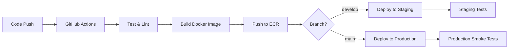

# LLM FAQ API - CI/CD and Kubernetes Deployment Guide

This guide covers the complete CI/CD pipeline and Kubernetes deployment for the LLM FAQ API on AWS.

## Architecture Overview

```
┌─────────────────┐    ┌─────────────────┐    ┌─────────────────┐
│   GitHub        │    │   AWS ECR       │    │   EKS Cluster   │
│   Repository    │───▶│   Container     │───▶│   Production    │
│   (CI/CD)       │    │   Registry      │    │   Workloads     │
└─────────────────┘    └─────────────────┘    └─────────────────┘
         │                       │                       │
         ▼                       ▼                       ▼
┌─────────────────┐    ┌─────────────────┐    ┌─────────────────┐
│   GitHub        │    │   Terraform    │    │   Application   │
│   Actions       │    │   State (S3)   │    │   Load Balancer │
│   Workflows     │    │   Backend      │    │   (ALB)         │
└─────────────────┘    └─────────────────┘    └─────────────────┘
```

## Prerequisites

### Required Tools
- AWS CLI v2+
- kubectl v1.27+
- Terraform v1.0+
- Docker 20.10+
- Git

### AWS Permissions
Your AWS user/role needs the following permissions:
- EKS Full Access
- EC2 Full Access
- ECR Full Access
- VPC Full Access
- IAM permissions for role creation
- Route53 (for DNS)
- Certificate Manager (for SSL)

### GitHub Secrets
Configure the following secrets in your GitHub repository:

```bash
AWS_ACCESS_KEY_ID         # AWS access key
AWS_SECRET_ACCESS_KEY     # AWS secret key
KUBE_CONFIG_DATA         # Base64 encoded kubeconfig (added after cluster creation)
```

## Infrastructure Setup

### 1. Terraform Backend Configuration

Create an S3 bucket for Terraform state:

```bash
aws s3 mb s3://your-terraform-state-bucket
aws s3api put-bucket-versioning \
    --bucket your-terraform-state-bucket \
    --versioning-configuration Status=Enabled
```

Update `terraform/main.tf` with your bucket name:

```hcl
backend "s3" {
  bucket = "your-terraform-state-bucket"  # Update this
  key    = "llm-faq-api/terraform.tfstate"
  region = "us-east-1"
}
```

### 2. Deploy Infrastructure

```bash
# Clone the repository
git clone https://github.com/parthoece/llm-faq-api.git
cd llm-faq-api

# Deploy everything (infrastructure + application)
./deploy.sh

# Or deploy infrastructure only
./deploy.sh infrastructure-only

# Or deploy application only (after infrastructure exists)
./deploy.sh application-only
```

### 3. Manual Infrastructure Deployment

If you prefer manual deployment:

```bash
cd terraform

# Initialize Terraform
terraform init

# Plan deployment
terraform plan -var="aws_region=us-east-1" -var="environment=production"

# Apply deployment
terraform apply -var="aws_region=us-east-1" -var="environment=production"

# Get outputs
terraform output
```

## CI/CD Pipeline

### Workflow Overview

The GitHub Actions workflow (`.github/workflows/ci-cd.yml`) includes:

1. **Test Stage**: Run unit tests and linting
2. **Build Stage**: Build and push Docker images to ECR
3. **Deploy Staging**: Deploy to staging environment (develop branch)
4. **Deploy Production**: Deploy to production environment (main branch)
5. **Security Scan**: Run vulnerability scans with Trivy

### Environments

#### Staging Environment
- **Trigger**: Push to `develop` branch
- **Namespace**: `staging`
- **Resources**: Reduced resource allocation
- **Access**: Internal load balancer

#### Production Environment
- **Trigger**: Push to `main` branch
- **Namespace**: `production`
- **Resources**: Full resource allocation with auto-scaling
- **Access**: Internet-facing load balancer with SSL

### Deployment Flow



## Kubernetes Configuration

### Resource Allocation

#### Production
- **Replicas**: 2 (auto-scaling: 2-10)
- **CPU**: 500m request, 2000m limit
- **Memory**: 2Gi request, 4Gi limit
- **Storage**: 5Gi for Ollama models

#### Staging
- **Replicas**: 1
- **CPU**: 250m request, 1000m limit
- **Memory**: 1Gi request, 2Gi limit
- **Storage**: 3Gi for Ollama models

### Auto-scaling Configuration

The HPA (Horizontal Pod Autoscaler) scales based on:
- CPU utilization: Target 70%
- Memory utilization: Target 80%
- Scale-up: Max 50% increase per minute
- Scale-down: Max 10% decrease per minute

### Health Checks

```yaml
livenessProbe:
  httpGet:
    path: /health
    port: 8000
  initialDelaySeconds: 120
  periodSeconds: 30

readinessProbe:
  httpGet:
    path: /health
    port: 8000
  initialDelaySeconds: 30
  periodSeconds: 10

startupProbe:
  httpGet:
    path: /health
    port: 8000
  initialDelaySeconds: 60
  periodSeconds: 10
  failureThreshold: 12
```

## Security Considerations

### Container Security
- Non-root user execution
- Read-only root filesystem
- Security context constraints
- Resource limits enforced

### Network Security
- Private subnets for worker nodes
- Security groups with minimal required access
- ALB with SSL termination
- Internal service communication

### Secrets Management
- Kubernetes secrets for sensitive data
- AWS IAM roles for service accounts
- ECR image scanning enabled

## Monitoring and Observability

### Metrics
- Kubernetes metrics server deployed
- HPA metrics collection
- Resource utilization monitoring

### Logging
- Container logs via CloudWatch
- Application logs structured (JSON)
- Error tracking and alerting

### Health Monitoring
- Application health endpoints
- Kubernetes probes
- Load balancer health checks

## Deployment Commands

### Common Operations

```bash
# Check deployment status
kubectl get deployments -n production
kubectl get pods -n production
kubectl get services -n production

# View logs
kubectl logs -f deployment/llm-faq-api -n production

# Scale manually
kubectl scale deployment llm-faq-api --replicas=3 -n production

# Update image
kubectl set image deployment/llm-faq-api llm-faq-api=ECR_URL:new-tag -n production

# Rollback deployment
kubectl rollout undo deployment/llm-faq-api -n production

# Check HPA status
kubectl get hpa -n production
kubectl describe hpa llm-faq-api-hpa -n production
```

### Troubleshooting

```bash
# Check node status
kubectl get nodes

# Describe problematic pods
kubectl describe pod POD_NAME -n production

# Check events
kubectl get events --sort-by=.metadata.creationTimestamp -n production

# Check resource usage
kubectl top nodes
kubectl top pods -n production

# Access pod shell
kubectl exec -it POD_NAME -n production -- /bin/bash
```

## Cost Optimization

### EC2 Instances
- Use spot instances for non-critical workloads
- Implement cluster autoscaler
- Schedule workloads efficiently

### Storage
- Use EBS GP3 volumes
- Implement lifecycle policies for ECR
- Clean up unused resources

### Networking
- Optimize data transfer costs
- Use VPC endpoints where applicable

## Backup and Disaster Recovery

### Data Backup
- ECR repositories replicated
- Terraform state in versioned S3
- Configuration in Git

### Recovery Procedures
1. Restore infrastructure with Terraform
2. Deploy latest application version
3. Verify service functionality
4. Update DNS if needed

## Performance Tuning

### Application Level
- Ollama model optimization
- Response caching implementation
- Connection pooling

### Kubernetes Level
- Resource requests/limits tuning
- Node affinity rules
- Pod disruption budgets

### Infrastructure Level
- Instance type optimization
- Network performance tuning
- Storage performance optimization

## Maintenance

### Regular Tasks
- Update Kubernetes version
- Update node AMIs
- Security patches
- Dependency updates

### Monitoring
- Resource utilization trends
- Performance metrics analysis
- Cost analysis and optimization

## Support and Troubleshooting

### Common Issues

1. **Pod Startup Failures**
   - Check resource limits
   - Verify image availability
   - Review startup probes

2. **Networking Issues**
   - Verify security group rules
   - Check load balancer configuration
   - Test service discovery

3. **Performance Issues**
   - Monitor resource usage
   - Check HPA behavior
   - Review application logs

### Getting Help
- Check application logs: `kubectl logs`
- Review Kubernetes events: `kubectl get events`
- Monitor resource usage: `kubectl top`
- AWS support for infrastructure issues

---

For additional support, please open an issue in the GitHub repository or contact the development team.
